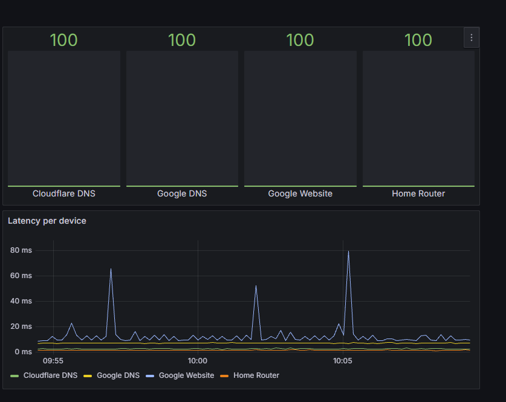
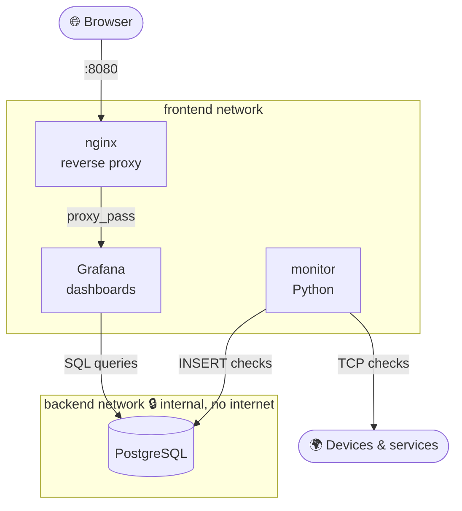

# 📡 Network Monitor

A self-hosted **network monitoring stack** that checks the availability and latency of network devices and services, stores every measurement in **PostgreSQL**, and visualizes uptime and latency in a **Grafana** dashboard, all behind an **nginx reverse proxy** and started with a single `docker compose up`.




---

## ✨ Features

- 🔍 **TCP service checks** against any host and port (DNS on 53, HTTPS on 443, a router's web UI on 80…)
- ⏱️ **Latency measurement** in milliseconds for every check
- 🗄️ Every result stored in **PostgreSQL** for history and analysis
- 📊 **Grafana dashboard**: latency over time per device, and uptime % with color thresholds
- 🔒 **Network segmentation**: the database lives on an internal network with no internet access
- 🚪 **Single entry point**: only nginx is exposed; Grafana and PostgreSQL are not reachable from outside
- 💪 **Resilient**: if the database goes down, the monitor logs the error and recovers automatically
- 🧱 **Infrastructure as code**: the database schema is created automatically on first start

---

## 🏗️ Architecture



| Service | Role | Networks | Exposed to host |
|---|---|---|---|
| `nginx` | Reverse proxy, the only public entry point | frontend | ✅ `8080` |
| `grafana` | Dashboards and visualization | frontend, backend | ❌ |
| `monitor` | Runs the checks and writes results | frontend, backend | ❌ |
| `db` | PostgreSQL database | backend (internal) | ❌ |

Containers find each other **by service name** through Docker's internal DNS (`db`, `grafana`), which is why no IP addresses are hard-coded.

---

## 📁 Project structure

```
network-monitor/
├── db/
│   └── schema.sql          # Tables, index and initial devices (runs on first start)
├── nginx/
│   └── default.conf        # Reverse proxy configuration
├── docs/
│   └── dashboard.png       # Dashboard screenshot
├── monitor.py              # The monitoring service
├── Dockerfile              # Image for the monitor service
├── docker-compose.yml      # The whole stack
├── requirements.txt        # Python dependencies
├── .env.example            # Required environment variables (no real values)
├── .dockerignore
└── .gitignore
```

---

## 🗄️ Database schema

```sql
devices (id, name, ip_address, port, created_at)
checks  (id, device_id → devices.id, checked_at, is_up, latency_ms)
```

- One device has **many** checks (one-to-many, enforced with a **foreign key**)
- An **index** on `(device_id, checked_at)` keeps time-range queries fast as the table grows

Example: uptime % and average latency per device:

```sql
SELECT
    d.name,
    ROUND(100.0 * SUM(CASE WHEN c.is_up THEN 1 ELSE 0 END) / COUNT(*), 1) AS uptime_percent,
    ROUND(AVG(c.latency_ms)::numeric, 1) AS avg_latency_ms
FROM checks c
JOIN devices d ON c.device_id = d.id
GROUP BY d.name
ORDER BY uptime_percent DESC;
```

---

## 🚀 Getting started

### Requirements

- [Docker Desktop](https://www.docker.com/products/docker-desktop/) (or Docker Engine with the Compose plugin)

### 1. Clone and configure

```bash
git clone https://github.com/Fivlles/network-monitor.git
cd network-monitor
cp .env.example .env     # then edit the passwords
```

### 2. Start the stack

```bash
docker compose up -d --build
docker compose ps
```

### 3. Open the dashboard

Go to **http://localhost:8080** and log in with `GRAFANA_USER` / `GRAFANA_PASSWORD` from your `.env`.

Add a **PostgreSQL** data source with host `db:5432`, database `network_monitor` and the database credentials from `.env` (TLS: disable).

### 4. Watch the monitor

```bash
docker compose logs -f monitor
```

```
[2026-10-04 08:52:59] Google DNS      8.8.8.8         🟢 UP   6.91 ms
[2026-10-04 08:52:59] Cloudflare DNS  1.1.1.1         🟢 UP   2.68 ms
[2026-10-04 08:52:59] Google Website  google.com      🟢 UP   9.55 ms
[2026-10-04 08:52:59] Home Router     192.168.1.1     🟢 UP   1.58 ms
```

### Stop

```bash
docker compose down        # stops everything, keeps the data
docker compose down -v     # also deletes the database and Grafana volumes
```

---

## ⚙️ Configuration

| Variable | Description | Example |
|---|---|---|
| `DB_HOST` | Database host (overridden to `db` inside Compose) | `localhost` |
| `DB_PORT` | Database port | `5432` |
| `DB_NAME` | Database name | `network_monitor` |
| `DB_USER` | Database user | `monitor` |
| `DB_PASSWORD` | Database password | `change-me` |
| `CHECK_INTERVAL` | Seconds between check rounds | `60` |
| `GRAFANA_USER` | Grafana admin user | `admin` |
| `GRAFANA_PASSWORD` | Grafana admin password | `change-me` |

### Adding a device

```bash
docker compose exec db psql -U monitor -d network_monitor
```

```sql
INSERT INTO devices (name, ip_address, port) VALUES ('My NAS', '192.168.1.50', 443);
```

The monitor picks it up automatically on the next round.

---

## 🧠 What I learned

- **Docker fundamentals**: images vs containers, port mapping, environment variables, `exec`, logs
- **Data persistence**: the difference between **bind mounts** and **named volumes**, and why container data is lost without them
- **Docker networking**: why `localhost` inside a container is the container itself, internal DNS by service name, bridge networks, subnets and gateways
- **Network segmentation**: an `internal` backend network for the database and least-privilege network access for each service
- **Docker Compose**: multi-container orchestration, health checks, `depends_on` with `service_healthy`, restart policies
- **PostgreSQL & SQL**: schema design, primary and foreign keys, indexes, `JOIN`, `GROUP BY`, `CASE`, aggregate functions, parameterized queries against SQL injection
- **Python**: TCP connectivity checks with `socket`, latency timing, database access, error handling for a long-running service
- **Grafana**: data sources, time-series and bar gauge panels, SQL macros like `$__timeFilter`, thresholds
- **nginx**: reverse proxying, forwarding headers, exposing a single entry point
- **Troubleshooting**: reading logs, `docker inspect`, `docker network inspect`, and a Windows Smart App Control block on a compiled database driver (solved by switching to the pure-Python `pg8000`)

---

## 🗺️ Possible improvements

- [ ] Grafana **provisioning**: data source and dashboard created automatically from files
- [ ] **Alerts** to Telegram when a device goes down
- [ ] ICMP ping and **SNMP** polling of the home router
- [ ] An `incidents` table with outage start/end times
- [ ] **HTTPS** on nginx
- [ ] Data retention: automatically delete checks older than N days
- [ ] A read-only database user for Grafana

---

## 👤 Author

[@Fivlles](https://github.com/Fivlles)